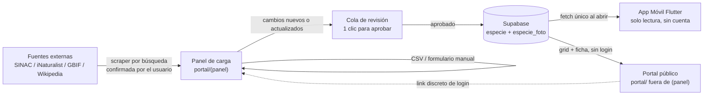

# Ticodex — Pokedex de la Fauna de Costa Rica

> Documento de proyecto — generado a partir de entrevista de requerimientos.
> Fecha: 2026-08-09. Revisado para acotar la Iteración 1 (MVP).

## 1. Visión (destino final, no lo que se construye ya)

Ticodex es una app móvil que convierte la observación de fauna costarricense en una
experiencia tipo "Pokedex": el usuario explora especies, las marca como **vistas y
fotografiadas**, y comparte sus avistamientos con una comunidad. El catálogo de
especies se construye y mantiene mediante un pipeline de datos propio (scraping
asistido + curación por un equipo interno, dentro de un panel de carga), no a mano
dentro de la app.

En su versión final, el contenido se libera incrementalmente por **zona de vida de
Holdridge** (el sistema bioclimático desarrollado por Leslie Holdridge trabajando en
Costa Rica; el país tiene 12 de las zonas de vida del sistema mundial). **La
Iteración 1 no llega a esto todavía** — ver §2.

## 2. Iteración 1 (MVP) — lo que se construye ahora

Alcance deliberadamente chico: probar el pipeline dato → panel → app de punta a
punta, sin las piezas que más esfuerzo piden (cuentas, geolocalización por región,
offline-first, revisión rica de candidatos).

### 2.1 Dos programas, nada más

**Programa 1 — App móvil (Flutter)**
- **Sin cuentas / sin login.** Cualquiera abre la app y ve el catálogo.
- Al abrir la app, se **jala una vez** la lista completa de especies publicadas
  (una sola llamada al backend; no hay sincronización continua ni cola offline).
- Solo muestra **la entrada de los animales**: lista/grid → tap → ficha de detalle
  (bilingüe ES/EN, fotos por tipo, sonido, descripción, hábitat, ubicación breve,
  estado de conservación). No hay captura, no hay marcar-como-visto, no hay perfil,
  no hay feed social, no hay álbum personal.
- El contenido crece especie por especie, según se vaya cargando desde el panel
  (manual, CSV, o scraper buscado — ver Programa 2) — no hay ningún lote ni lista
  semilla precargada.

**Programa 2 — Portal web (`portal/`, Next.js en Vercel) — dos superficies, una app**
- **Pública** (todo lo que queda fuera del grupo de rutas `(panel)`): catálogo real
  de especies — grid + ficha de detalle, misma experiencia de contenido que la app
  Flutter pero en la web, bilingüe ES/EN, leyendo `especie`/`especie_foto` con
  `estado_publicacion = 'publicado'`. Sin login, cualquiera la navega. Incluye un
  link discreto de acceso al panel interno (decisión 2026-08-28, ver §9).
- **Interna** (grupo de rutas `(panel)` + sus rutas bajo `/api/*`): panel de carga
  para equipo interno, con login simple (Supabase Auth).
- **Detección de "quién es equipo interno":** cualquier login exitoso contra
  Supabase Auth entra directo al panel — no hay tabla de roles todavía (decisión
  2026-08-28, ver §9; ver preguntas abiertas §10 sobre cuándo hará falta
  diferenciar roles).
- Este portal es el único sitio web público de Ticodex — GitHub Pages se retira
  como sitio publicado (ver §5).
- Formulario manual + subida de CSV + plantilla descargable, como ya estaba definido.
- **Scraper pequeño integrado, disparado por búsqueda** (no un configurador de
  fuentes/campos por corrida, y no una lista fija que el sistema recorre solo): el
  equipo interno busca un animal por nombre, el panel muestra candidatos que
  coinciden (usando la búsqueda propia de iNaturalist/GBIF), la persona confirma
  cuál es, y recién ahí se jalan los datos completos de esa especie puntual contra
  las fuentes ya configuradas. El scraper nunca elige una especie por su cuenta.
- Esos cambios **no se publican solos**: llegan como pendientes de revisión: el
  equipo interno hace una revisión rápida (un clic para aprobar tal cual, o editar y
  luego aprobar) antes de que aparezcan en la lista que consume la app.

### 2.2 Explícitamente fuera de esta iteración (van al roadmap, §3)

- Cuentas de usuario, login en la app.
- Captura de avistamientos (cámara + GPS), marcar especie como vista.
- Perfil, progreso, feed social, álbum personal, favoritos.
- Navegación/organización por región o zona de vida — la Iteración 1 es una sola
  lista plana.
- Offline-first / sincronización — la app solo hace un fetch al abrir; qué tan bien
  funciona sin señal después de eso no es un requisito diseñado todavía.
- Configurador de "elegir fuentes + tipos de campo" por corrida — el scraper de esta
  iteración corre con una configuración fija, no por parámetros que el usuario arma
  cada vez.
- Frecuencia/rareza por región (depende de avistamientos, que no existen sin cuentas).

## 3. Roadmap — visión completa (fases futuras, no MVP)

Todo esto sigue siendo la visión del producto (ya se habló en la entrevista) pero se
construye **después** de validar la Iteración 1:

1. **Cuentas + captura + factor social**: login de usuario final, marcar
   vista/fotografiada, feed comunitario, álbum personal privado con favoritos
   (evento público vía `visible_comunidad`, foto opcionalmente privada vía
   `foto_compartida` — ambas cosas coexisten, no se reemplazan).
2. **Regionalización por zona de vida de Holdridge**: selector/mapa, expansión
   incremental región por región, `frecuencia_estimada_inicial` vs
   `frecuencia_observada` (esta última calculada de avistamientos reales).
3. **Offline-first real**: descarga por región, cola local de avistamientos, sync.
4. **Scraper configurable**: elegir fuentes + tipos de campo por corrida, en vez de
   una configuración fija.

`PLAN_IMPLEMENTACION.md` desarrolla estas fases en detalle.

## 4. Usuarios y roles (Iteración 1)

| Rol | Dónde | Descripción |
|---|---|---|
| Usuario final | App móvil | Anónimo, sin cuenta. Solo explora el catálogo. |
| Visitante web | Portal (`portal/`, fuera de `(panel)`) | Anónimo, sin cuenta. Mismo catálogo (grid + ficha) que la app, en la web. |
| Equipo interno | Portal (`portal/(panel)`) | Login único contra Supabase Auth. Cualquier login exitoso es equipo interno (sin tabla de roles todavía). Sube CSV, llena formularios, dispara el scraper, revisa y aprueba lo que el scraper trae. |

## 5. Infraestructura

- Proyecto Supabase: **Ticodex** (ref `weagfzykzqiixjyqejbc`), organización "Local",
  región `us-east-1`, tier gratuito ($0/mes). Creado el 2026-08-10.
- Este es el único proyecto Supabase de Ticodex — no confundir con otros proyectos
  de la misma cuenta (BolisGourmet, CRdle, moka-kimchi-tcg, u otros).
- Storage bucket `especie-media` (público para lectura, escritura solo equipo
  interno autenticado) — usado por `especie_foto` y `especie.sonido_url`.
- Esquema Fase 1 aplicado: `especie`, `especie_foto`, `candidato_especie`,
  `import_job`, con RLS. Tipos TypeScript en `supabase/database.types.ts`.
- Falta crear al menos un usuario de equipo interno en Supabase Auth (Dashboard →
  Authentication → Users) — sin esto, nadie puede entrar al panel de carga
  (`portal/`) todavía.
- **El portal (`portal/`), desplegado en Vercel, es el único sitio web público de
  Ticodex** (decisión 2026-08-28). GitHub Pages (que servía `docs/mockups.html`) se
  retira como sitio publicado: hay que desactivarlo desde la configuración del
  repositorio en GitHub (Settings → Pages) — esto es una acción manual de
  administración del repo, no le corresponde a ningún agente de `.claude/agents/`.
  El archivo `docs/mockups.html` se queda en el repo únicamente como referencia
  interna de diseño (igual que `docs/mockups.pdf`), no como algo que alguien
  navegue en producción. La app Flutter no se toca por esta decisión.

## 6. Arquitectura general (Iteración 1)

**Principio de pipeline de datos:** nada llega a la lista que ve la app sin pasar por
la cola de revisión del panel — ni un CSV, ni un pull del scraper. Un único punto de
control de calidad, sin importar el origen del dato.

## 7. Modelo de datos (Iteración 1)

> Las tablas de cuentas, avistamientos, regiones y frecuencia calculada existen en la
> visión completa (§3) pero **no se construyen en esta iteración**. Se documentan en
> `PLAN_IMPLEMENTACION.md` para cuando corresponda, no acá.

### `especie`
| Campo | Tipo | Notas |
|---|---|---|
| id | uuid | |
| nombre_comun_es / nombre_comun_en | text | |
| nombre_cientifico | text | |
| clase_taxonomica | enum | mamífero, ave, reptil, anfibio, insecto, ... |
| familia | text | |
| estado_conservacion | enum UICN | LC, NT, VU, EN, CR, EW, EX, DD |
| endemica | bool | |
| descripcion_es / descripcion_en | text | historia natural básica |
| habitat_es / habitat_en | text | descripción de hábitat, más extensa |
| ubicacion_breve_es / ubicacion_breve_en | text | "mini texto" de dónde se encuentra, para lectura rápida en la ficha |
| sonido_url | text | Supabase Storage — sonido característico |
| tiene_dimorfismo_sexual | bool | si es true, no se puede publicar sin foto de `macho` Y `hembra` |
| tiene_diferencia_juvenil | bool | si es true, no se puede publicar sin foto de `juvenil` |
| origen_dato | enum | `scraping`, `manual` |
| estado_publicacion | enum | `borrador`, `publicado` — solo `publicado` llega al fetch de la app |
| creado_en / actualizado_en | timestamp | |

**Gate de publicación (trigger `especie_validar_antes_publicar`, aplicado en la base
de datos, no solo en el panel):** no se puede poner `estado_publicacion = 'publicado'`
si falta cualquiera de nombre_comun_es/en, nombre_cientifico, estado_conservacion,
descripcion_es/en, habitat_es/en, ubicacion_breve_es/en. Para fotos, la regla es
**mutuamente excluyente** entre "estándar" y "macho+hembra" (decisión 2026-08-10: no
tiene sentido exigir una foto `adulto` genérica si la especie tiene dimorfismo
sexual, sería redundante con macho/hembra):
- Si `tiene_dimorfismo_sexual` es **false**: exige foto `adulto` (mostrada como
  "ESTÁNDAR" en la UI cuando es la única).
- Si `tiene_dimorfismo_sexual` es **true**: exige foto `macho` **y** `hembra` — no
  pide `adulto` en absoluto.
- Si `tiene_diferencia_juvenil` es true, exige además foto `juvenil` — esta es
  independiente de la regla anterior, se suma en cualquiera de los dos casos.

Aplica igual a un candidato aprobado que al formulario manual — es una regla de
integridad de datos, no una validación que se pueda saltar desde ningún camino de
escritura.

### `especie_foto`
| Campo | Tipo | Notas |
|---|---|---|
| id | uuid | |
| especie_id | uuid | |
| tipo | enum | `adulto`, `juvenil`, `macho`, `hembra`, `otro` — dimorfismo sexual y etapas de vida |
| url | text | Supabase Storage |
| es_principal | bool | cuál se usa como miniatura en el grid |
| orden | int | |

### `candidato_especie` (cola de revisión del scraper — nuevos y actualizaciones)
| Campo | Tipo | Notas |
|---|---|---|
| id | uuid | |
| tipo_cambio | enum | `nuevo` (especie que no existía), `actualizacion` (cambios a una ya publicada) |
| especie_id | uuid (nullable) | referencia a la especie existente si `tipo_cambio = actualizacion` |
| fuente | text | de dónde lo trajo el scraper |
| campos_propuestos | jsonb | datos crudos/propuestos a aplicar |
| estado | enum | `pendiente_revision`, `aprobado`, `descartado` |
| creado_en | timestamp | |

Aprobar un candidato de tipo `nuevo` crea una fila en `especie`; aprobar uno de tipo
`actualizacion` aplica `campos_propuestos` sobre la fila existente. Ambos casos pasan
por el mismo botón de aprobación en el panel — no hay publicación automática.

### `import_job` (trazabilidad de cargas CSV)
| Campo | Tipo | Notas |
|---|---|---|
| id | uuid | |
| usuario_admin_id | uuid | |
| archivo_csv_url | text | |
| filas_totales / filas_ok / filas_error | int | |
| log_errores | jsonb | |
| creado_en | timestamp | |

## 8. Funcionalidades clave (Iteración 1)

### App móvil (Flutter)
1. **Lista/grid de especies** — un solo fetch al abrir la app, sin paginación por
   región (no existe esa noción todavía).
2. **Ficha de especie** — bilingüe con toggle ES/EN; fotos por tipo (adulto, juvenil,
   macho, hembra), sonido, descripción, hábitat, ubicación breve, estado de
   conservación. Sin botones de captura ni de "marcar visto".

### Panel de carga (portal web interno)
1. **Login** (Supabase Auth, equipo interno únicamente).
2. **Descargar plantilla CSV** con las columnas del modelo `especie`/`especie_foto`.
3. **Subir CSV** con previsualización de validación fila por fila antes de confirmar import.
4. **Formulario manual** para crear/editar una especie (incluye subida de fotos por tipo).
5. **Scraper integrado por búsqueda** — el equipo interno busca un animal por nombre
   (común ES/EN o científico), el panel muestra candidatos que coinciden (vía
   iNaturalist/GBIF), se confirma cuál es, y recién ahí se jalan los datos completos
   de esa especie contra las fuentes configuradas, aterrizando en la cola de
   revisión. El scraper nunca elige una especie por su cuenta ni recorre una lista
   propia — no hay botón de "traer todo de una".
6. **Cola de revisión** — lista de candidatos (`nuevo`/`actualizacion`) pendientes;
   aprobar (tal cual o editando antes) o descartar, uno por uno.
7. **Historial de importaciones** (`import_job`) para trazabilidad.

## 9. Decisiones tomadas en la entrevista

- Ubicación del proyecto: `C:\Users\Daae2\Ticodex`.
- **Iteración 1 muy acotada**: sin cuentas, una sola lista plana de especies (sin
  tope técnico, crece según se cargue), fetch único al abrir la app, panel con
  scraper disparado por búsqueda (el usuario busca y confirma el animal, nunca lo
  elige el sistema) cuyos resultados pasan por revisión de un clic antes de publicar.
- **Scraper por búsqueda, no por lista** (2026-08-10): se eliminó la lista fija de
  ~10 especies piloto precargada en config — el "motor de búsqueda" usa las
  capacidades de búsqueda propias de iNaturalist (`/v1/taxa?q=`, con soporte de
  nombres comunes por idioma) y GBIF (`/v1/species/search`), sin depender de ningún
  motor de búsqueda general externo.
- Todo lo demás ya conversado en la entrevista (regiones por zona de vida de
  Holdridge, cuentas, captura, factor social, álbum personal, offline-first,
  scraper configurable por fuentes/campos) sigue siendo la visión del producto, pero
  pasó a ser roadmap (§3), no parte de esta iteración.
- Plataforma: app móvil en Flutter. Backend: Supabase (Postgres + Auth + Storage).
- Idioma: bilingüe español/inglés desde la Iteración 1.
- **Ticodex es un proyecto no comercial por ahora** (2026-08-10). Esto habilita usar
  contenido con licencia CC-BY-NC (ej. fotos de iNaturalist) sin violar la
  restricción de uso no comercial. No resuelve por sí solo las licencias que exigen
  atribución (CC-BY-SA de Wikipedia, y por extensión el resumen de texto que expone
  iNaturalist) — para esas se agregó el campo `especie.atribucion_fuente`, mostrado
  en la ficha de la app cuando no es null. Si el proyecto se vuelve comercial más
  adelante, esta decisión se tiene que revisar de nuevo, en particular las fotos NC.
- Con la atribución visible + el criterio no-comercial, se habilitaron como fuentes
  del scraper: **GBIF, iNaturalist, Wikipedia especies**. **SINAC sigue bloqueada**
  — no tiene API pública documentada ni ToS de scraping; hay una pista real sin
  confirmar (Portal Nacional de Datos Abiertos de Costa Rica, datosabiertos.gob.go.cr,
  y el SNIT) que alguien tiene que revisar a mano, no es algo que se resuelva en código.
- **Gate de publicación obligatorio** (2026-08-10): ninguna especie puede quedar
  `publicado` con campos en blanco o sin sus fotos requeridas — ver el detalle en §7.
  Aplica tanto a candidatos del scraper como al formulario manual, implementado como
  trigger de base de datos (no solo validación de UI). Motivó dos cambios más: se
  vació la cola de revisión que existía hasta ahora (candidatos incompletos bajo el
  criterio viejo) y se le pidió al scraper que traiga más campos por especie en vez
  de dejarlos para completar a mano.
- "Multiagentes" = workflow de desarrollo con subagentes de Claude Code (ver
  `PLAN_IMPLEMENTACION.md`), no una feature de IA dentro del producto.
- **Contenido público del portal web = catálogo real** (2026-08-28): la superficie
  pública de `portal/` no es una landing de marketing ni un mockup estático, es el
  catálogo real (grid + ficha de especie) leyendo `especie`/`especie_foto` con
  `estado_publicacion = 'publicado'` desde Supabase — la misma experiencia de
  contenido que ofrece la app Flutter, en la web.
- **Detección de admin = cualquier login exitoso** (2026-08-28): no se construye
  tabla de roles en esta iteración. Cualquier cuenta que entra a Supabase Auth
  desde `/login` se trata como equipo interno y entra al panel completo. Si más
  adelante hace falta diferenciar (p. ej. editor vs. administrador), es una
  decisión y un esquema nuevos, no algo que se infiera del código actual — ver
  pregunta abierta en §10.
- **Vercel es el sitio único, GitHub Pages se retira** (2026-08-28): el portal en
  Vercel pasa a ser el único sitio web público de Ticodex. GitHub Pages
  (`docs/mockups.html`) deja de publicarse; el archivo queda solo como referencia
  interna de diseño (ver §5). La app Flutter no cambia por esta decisión.

## 10. Preguntas abiertas

- ¿Qué fuentes exactas usa el scraper en esta iteración, y están confirmadas sus
  licencias/ToS para extraer y redistribuir esos datos?
- ¿"Configuración fija" del scraper significa un conjunto de fuentes+campos que el
  equipo interno puede editar en código/config, o debería ser editable desde el
  panel aunque no cambie por corrida? (Asumido: editable en config, no en UI, para
  esta iteración — confirmar si no es así.)
- Cuando se aprueba una `actualizacion` sobre una especie publicada, ¿se sobrescribe
  directo, o se guarda un historial de versiones? (Asumido: sobrescribe directo para
  esta iteración.)
- Enumeración geográfica exacta de las zonas de vida de Holdridge — solo relevante
  cuando se llegue a la fase de regionalización (§3), no bloquea la Iteración 1.
- **¿Sonido por sexo?** (2026-08-10) El dimorfismo vocal es real y común en la
  naturaleza (en muchas aves canoras solo canta el macho; en la mayoría de las ranas
  solo el macho llama — [Zebra Finch Syrinx](https://journals.plos.org/plosone/article?id=10.1371/journal.pone.0011368),
  [Xenopus laevis](https://pmc.ncbi.nlm.nih.gov/articles/PMC6772357/)). Hoy
  `especie.sonido_url` es un solo campo, sin distinción por tipo (a diferencia de
  `especie_foto`, que sí tiene `tipo`). Si se quiere modelar sonido por
  macho/hembra/juvenil habría que extender el esquema de forma análoga a
  `especie_foto` — no se hizo todavía, queda pendiente de decisión explícita.
- **¿Cuándo hace falta diferenciar roles dentro del equipo interno?** (2026-08-28)
  Hoy cualquier login exitoso contra Supabase Auth es equivalente (ver §9) — no
  hay editor vs. administrador, ni forma de restringir qué puede hacer una cuenta
  interna. No bloquea la Iteración 1 (el equipo interno es chico y de confianza),
  pero si el equipo crece o se necesita auditoría por persona, hace falta una
  tabla de roles explícita — no asumir que se puede agregar "después, sobre la
  marcha" sin migración.

## 11. Documentos relacionados

- [`PLAN_IMPLEMENTACION.md`](./PLAN_IMPLEMENTACION.md) — plan de implementación por
  fases con subagentes de Claude Code (MVP primero, luego roadmap).
- [`DISENO.md`](./DISENO.md) — lenguaje visual: paleta pixel art (Amity Square),
  tipografía, reglas de grid y contornos. Sin emojis en ningún entregable.
- [`TEST_PLAN.md`](./TEST_PLAN.md) — checklist manual de pruebas (panel + app),
  con los chequeos transversales que ya atraparon un bug real (formularios con
  múltiples botones y validación mal alcanzada).
- [`docs/mockups.pdf`](./docs/mockups.pdf) — mockups de la Iteración 1 (MVP), en el
  estilo visual de `DISENO.md`.
- [`.claude/agents/`](./.claude/agents/) — definiciones de los subagentes del proyecto.
